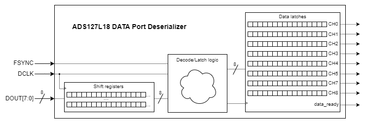

# Example FPGA code for ADS127L18 data port
This is an example of how to latch data from the [ADS127L18](https://www.ti.com/product/ADS127L18) frame-sync data port that outputs the channel conversion data. The data port is a synchronous, read-only interface with synchronized output clock signals (FSYNC and DCLK) and channel data (DOUTn). This verilog module captures and splits the continuous 1/2/4/8 lane data (including STATUS and CRC bytes if enabled) into eight separate channels and latches the data between frames.   

#### Block Diagram


#### Usage
When instanciating this block you must specifiy the number of data lanes and the expected number of bits per channel packet, according to the data length (16- or 24-bit) and whether or not STATUS and CRC bytes will also be included in the data packet.

```Verilog
ADS127L18_tdm_deserializer #(
    .LANE_COUNT         (8),    // [1|2|4|8]
    .BITS_PER_PACKET 	(24)    // [16|24|32|40]
)
...
```

## References
[ADS127L18 product page](https://www.ti.com/product/ADS127L18)